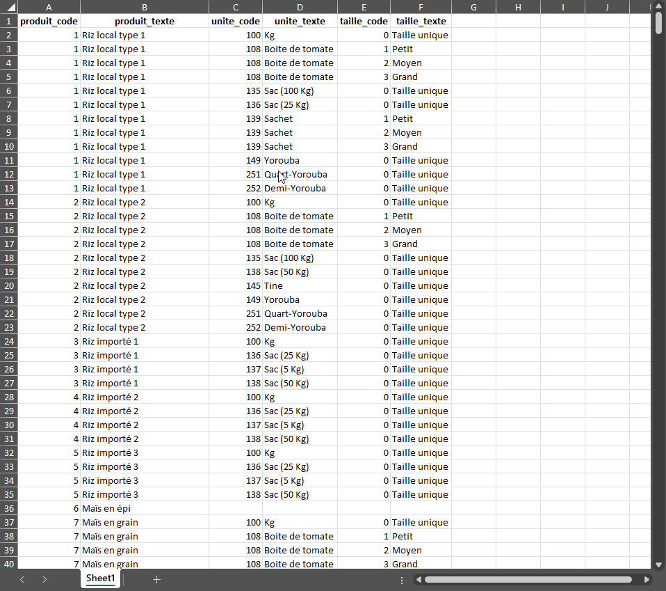
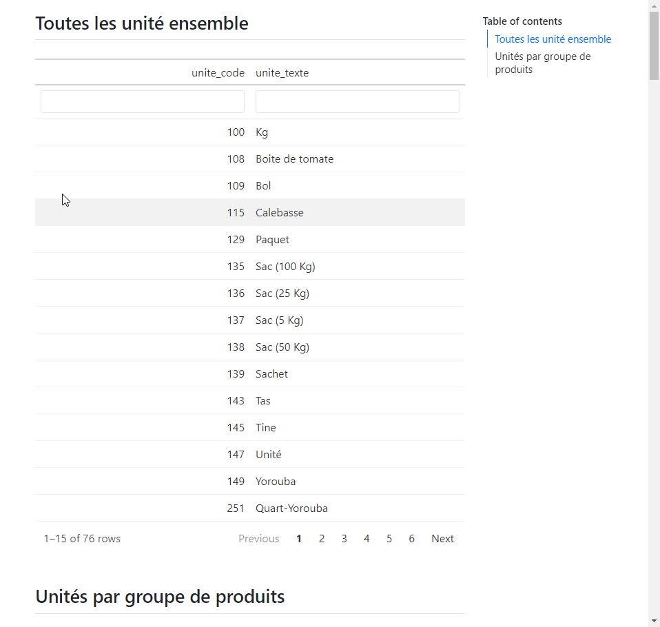

## Objectif 🎯

Créer deux sorties pour faciliter l'actualisation des tableaux de référence :

1. **Tableau de référence "lisible par les humains"** où :
  - Les combinaisons de produit-unité-taille arrêtée lors de l'EHCVM paraîtront à côté d'étiquettes de valeur pour faciliter la lecture.
  - Les numéros de produits auront été actualisés
  - Certains produits nouvellement éclatés hériteront de leur produit d'origine, donnant une bonne place de départ
  - Les produits sans unité figureront comme des lignes vides, que ce soit des produits sans unités lors de l'EHCVM2 ou de nouveaux produits où les unités ne sont pas claires.
2. **Compilation des unités**
  - Liste exhaustive des unités employées pour au moins un produit
  - Liste d'unités par groupe de produits alimentaires

Voici quelques catpures indicatives

Pour le tableau de référence :

Pour la compilation de produits :

## Installation 🔌

### Les pré-requis

- R
- RTools, si l'on utilise Windows comme système d'exploitation
- RStudio

Ouvrir pour voir plus de détails 👁️

#### R

- Suivre ce [lien](https://cran.r-project.org/)
- Cliquer sur votre système d'exploitation
- Cliquer sur `base`
- Télécharger and installer (e.g.,
  [this](https://cran.r-project.org/bin/windows/base/R-4.4.2-win.exe)
  pour le compte de Windows)

#### RTools

Nécessaire pour le système d'exploitation Windows

- Suivre ce [lien](https://cran.r-project.org/)
- Cliquer sur `Windows`
- Cliquer sur `RTools`
- Télécharger
  (e.g.,[this](https://cran.r-project.org/bin/windows/Rtools/rtools44/files/rtools44-6335-6327.exe) pour une architecture
  64bit)
- Installer dans le lieu de défaut suggéré par le programme d'installation (e.g., `C:\rtools4'`)

Ce programme permet à R de compiler des scripts écrit en C++ et utilisé par certains packages pour être plus performant (e.g., `{dplyr}`).

#### RStudio

- Suivre ce [lien](https://posit.co/download/rstudio-desktop/)
- Cliquer sur le bouton `DOWNLOAD RSTUDIO`
- Sélectionner le bon fichier d'installation selon votre système d'exploitation
- Télécharger et installer (e.g.,
  [this](https://download1.rstudio.org/electron/windows/RStudio-2024.09.1-394.exe)
  pour le compte de Windows)

RStudio est sollicité pour deux raisons :

1. Il fournit une bonne interface pour utiliser R
2. Il est accompagné par [Quarto](https://quarto.org/), un programme dont nous nous serviront pour créer certains documents.

### Le programme

- Si vous n'avez pas Git, 
  - Cliquer sur le bouton `Code`
  - Sélectionner `Download ZIP` depuis la liste déroulante
  - Décomprimer dans / vers le dossier voulu
- Si vous avez Git, suivre les instructions [ici](https://docs.github.com/en/repositories/creating-and-managing-repositories/cloning-a-repository).

## Configuration ⚙️

Le programme a besoin des entrées suivantes.

Pour l'EHCVM2 :

- [Tableaux de référence](#tableaux-de-référence)
- [Questionnaire CAPI en format JSON](#questionnaire-capi-en-format-json)

Pour l'EHCVM3 :

- [Questionnaire Excel](#entrées-de-lehcvm3), où les produits auront été adapté au contexte pays

### Entrées de l'EHCVM2

#### Tableaux de référence

Pour actualiser les tableaux, il faut les chercher dans le questionnaire de l'édition passée :

- Retrouver le questionnaire CAPI chez Designer
- Télécharger les tableaux de référence qui traite des produits-unités-tailles valides

L'on devrait s'attendre à télécharger 11 fichiers.

#### Questionnaire CAPI en format JSON

Il y a deux méthodes pour localiser ce fichier (i.e., `document.json`) :

1. Chercher dans les fichiers d'exportation de l'EHCVM2.
2. Importer les questionnaire dans un serveur, exporter les données en bien sélectionnant vouloir les métadonnées du questionnaire, et rechercher le fichier parmi les fichiers d'exportation.

Voir sous la rubrique `Metadata` [ici](https://docs.mysurvey.solutions/headquarters/export/data-export-tab/) pour plus d'information.

### Entrées de l'EHCVM3

Comme le questionnaire CAPI peut ne pas être à jour, on exploitera la version Excel.

Pour ce faire :

- Sauvegarder la version pays
- Sauvegarder sous format `xlsx` si le fichier a une extension `xlsm`

## Emploi 👩‍💻

Après avoir installé les pré-requis et mis en places les entrées attendues, il suffit de lancer le programme en R. En particulier :

- Ouvrir le RStudio
- Ouvrir le répertoire comme un projet (ou bien double-cliquer sur le fichier `creer_tableau_excel.Rproj`)
- Cliquer sur le bouton `Source` chez RStudio pour lancer le programme
